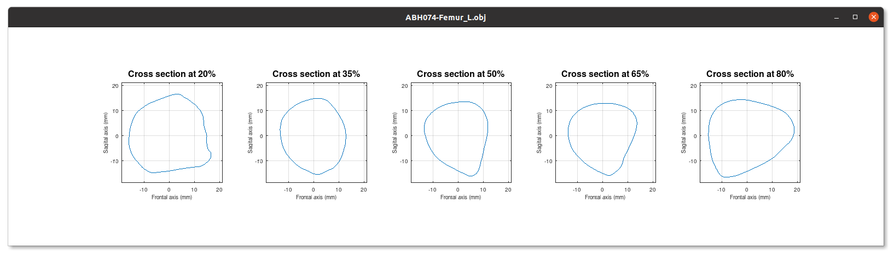
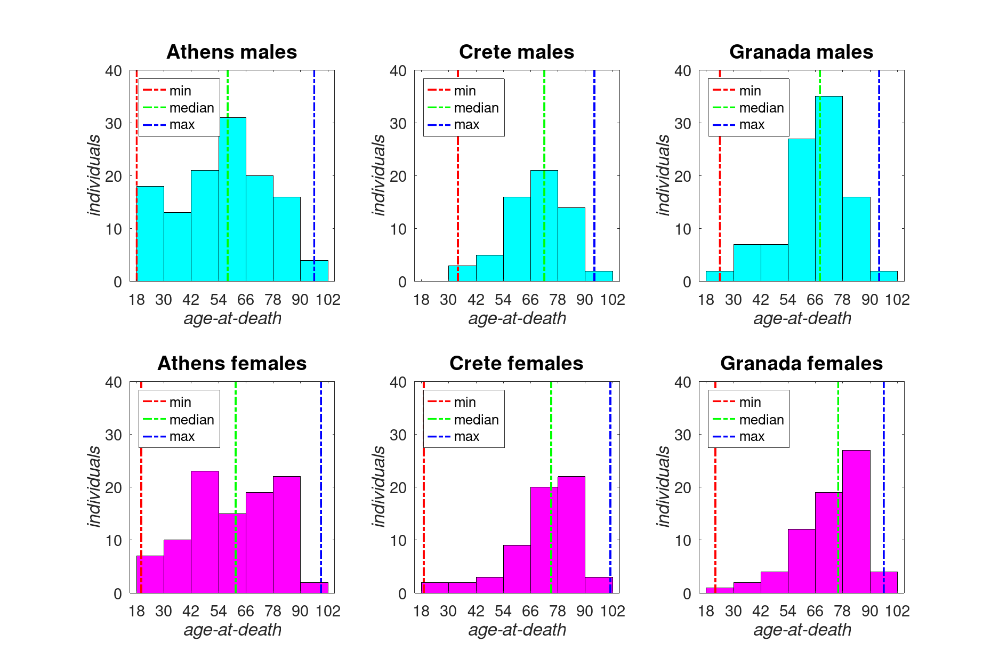

# csg-dataset
## A large dataset of diaphyseal cross sectional geometric properties and relevant measurements from human long bones.

The present GNU Octave package contains the largest (to date) public dataset of diaphyseal CSG properties of human long bones. The dataset is split between two files, `cross-sections.mat` and `csg-properties.mat`, each containing a $2 \times 24$ cell array saved in Octave's native binary format. Both files become available into the load path once the **csg-dataset** package has been loaded and they can be separately loaded into Octave's workspace with the `load` command.

`csg-properties.mat` contains a total of 61 measurements extracted from 3618 digital twins of intact femur, humerus, tibia, and ulna bones, which belong to 518 adult individuals of known sex and age-at-death derived from three European skeletal reference collections. More specifically, the Athens Collection, which is housed at the Department of Animal and Human Physiology of the National and Kapodistrian University of Athens, the Cretan Collection, which is housed at the Forensic Medicine Unit of the Faculty of Medicine of the University of Crete, and the Granada Collection, which comprises individuals from the Cemeterio de San José Cemeterio in Granada, Andalucia and it is currently curated at the Department of Toxicollogy and Physical Anthropology of the University of Granada. These measurements include the maximum distance of each bone and a battery of CSG properties and other measurements computed from five diaphyseal cross sections sliced at 20%, 35%, 50%, 65%, and 80% of the long bone's longitudinal axis. The 2D polygons representing each of the 18,090 cross sections are stored in `cross-sections.mat`.

Both cell arrays stored in `cross-sections.mat` and `csg-properties.mat` follow the same layout. The samples are grouped per skeletal collection (Athens, Crete, Granada), per bone (Femur, Humerus, Tibia, Ulna), and per side (Left, Right), with each column corresponding to a distinct group. The first row contains each group's description tag (e.g. `'Athens Femur Left'`) and the second row contains the corresponding data, which for CSG properties are stored in cell arrays and for cross sections are stored in structure arrays. Each sample's ID (based on the 3D model filename), sex, and age-at-death info is stored in both cell arrays making `cross-sections.mat` and `csg-properties.mat` data files completely independent and self-documented.

The data in `csg-properties.mat` can be regrouped into four numerical arrays (variables named **`Femur`**, **`Humerus`**, **`Tibia`**, and **`Ulna`**) by aggregating collections and sides into a single group for each long bone with the accompanying `longbone_SampleStats` script, which is part of the **csg-dataset** package. The `longbone_SampleStats` script automatically saves the aforementioned numerical arrays into a new binary data file, named `Bone-Data.mat`, as well as it calculates the dataset sample statistics presented below.

* The dataset of long bone diaphyseal cross sectional geometric properties contained and distributed as the **csg-dataset** package is licensed under the Creative Commons Attribution 4.0 International license. [(CC BY 4.0)](https://creativecommons.org/licenses/by/4.0/)
* The `longbone_SampleStats` script is licensed under the GNU General Public License version 3. [(GPLv3)](https://www.gnu.org/licenses/gpl-3.0.en.html)

## Installation and dependencies

The **csg-dataset** is compatible with any version of GNU Octave, if you want to access the raw data stored in the two binary data files. However, to make the most out of it, you may also need to install and load the [`csg-toolkit >= 1.4.1`](https://github.com/pr0m1th3as/csg-toolkit/) package in order to utilize its cross-sectional ploting utilities. Furthermore, you will need the [`statistics >=1.7.4`](https://gnu-octave.github.io/packages/statistics/) and [`datatypes >=1.0.1`](https://github.com/pr0m1th3as/datatypes/) packages in order to run the `longbone_SampleStats` script.

To download and install the latest version, type:
```
pkg install -forge csg-dataset
```
The package can be loaded on demand with the following commmand:
```
pkg load csg-dataset
```
To load the dataset into Octave's workspace, type:
```
load cross-sections.mat
load csg-properties.mat
```
Use the following syntax to specify custom names for the cell array variables to be loaded into workspace:
```
data1 = load ('cross-sections.mat').cross_sections;
data2 = load ('csg-properties.mat').csg_properties;
```
You may plot the cross sections of a specific sample contained in the data set by utilizing the additional functionality provided by the csg-toolkit package, as shown in the following example:
```
## Load required packages
pkg load csg-toolkit
pkg load csg-dataset
## Load dataset specific to cross sectional 2D polygons
load cross-sections.mat
## Copy the structure array from the first group of the dataset
cs = cross_sections{2,1};
## Plot the first sample of the selected group
plot_CrossSections (cs(1));
```
which results to the following figure:

## Sample description

The following table summarizes the number of skeletal elements in each group according to collection, bone, and side.
```
                   Femur           Humerus           Tibia            Ulna
               _____________    _____________    _____________    _____________

               Left    Right    Left    Right    Left    Right    Left    Right
               ____    _____    ____    _____    ____    _____    ____    _____

    Athens      196      200     204      209     205      210     206      200
    Crete       106      103     114      115     117      115      97      100
    Granada     148      146     130      140     150      149     131      127
    Total       450      449     448      464     472      474     434      427
```
The following table summarizes the number of skeletal elements per sex for each bone and collection as well as the number of individuals per sex for each collection.
```
                        Athens              Crete              Granada
                   ________________    ________________    ________________

                   Males    Females    Males    Females    Males    Females
                   _____    _______    _____    _______    _____    _______

    Femur            220        176      108        101      172        122
    Humerus          231        182      120        109      156        114
    Tibia            224        191      118        114      168        131
    Ulna             228        178      109         88      153        105
    Individuals      126        101       62         61       98         70
```
The following table summarizes the minimum, median, and maximum age-at-death of the individuals in each collection, whereas the figure below illustrates the age-at-death distributions for males and females in each collection.
```
                      Athens                  Crete                  Granada
               ____________________    ____________________    ____________________

               Min    Median    Max    Min    Median    Max    Min    Median    Max
               ___    ______    ___    ___    ______    ___    ___    ______    ___

    Males       18        58     96     34        72     94     24        68     94
    Females     20        62     99     19        75    101     22        76     96
    All         18        59     99     19        75    101     22        72     96
```


## Acknowledgements

I would like to express my gratitude to Professor *Efstratios Valakos* (Athens), Assistant Professor *Elena Kranioti* (Crete), and Professor *María Inmaculada Alemán Aguilera* (Granada) for granting me access to the respective skeletal collections in order to create the long bone digital twins from which the present dataset was derived.

The **csg-dataset** package for the GNU Octave programming language is part of the research output of my [RECONSTRUCT](https://www.physicalanthropology.gr/reconstruct.php) project, which has received funding from the European Union’s Horizon 2020 research and innovation programme under the Marie Sklodowska-Curie Grant agreement No 101104702.
